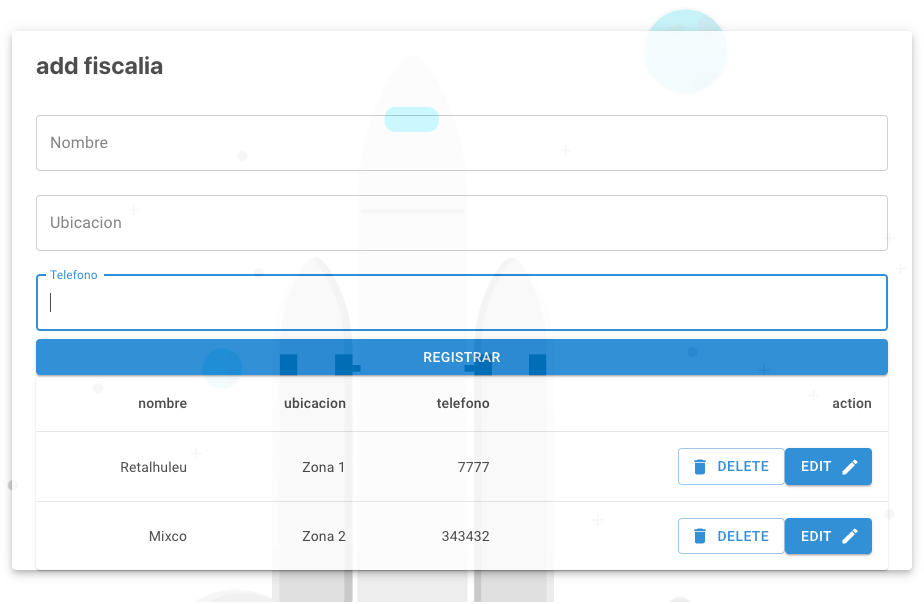
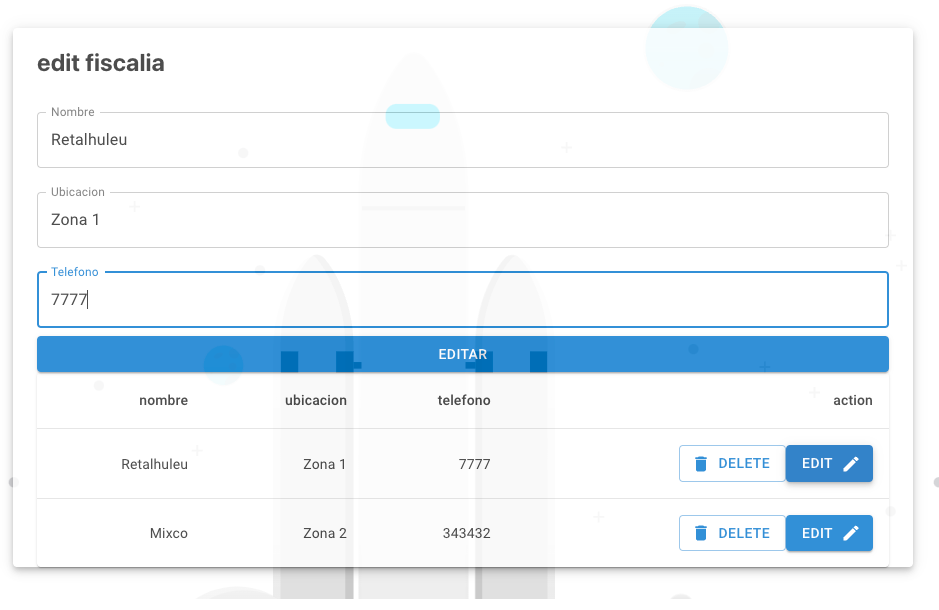

# Manual tecnico 

Simple CRUD:

- React JS - Hooks - Axios
- Springboot - JPA 
- MySQL - Docker

## Frontend

Se crearon diferentes componentes, para la elaboracion del un simple crud, en el que usuario permita: ver, editar, crear y eliminar, registros de una tabla

##### Componentes:

- App.js
  - Foos.jsx
    - EditFoo.jsx
    - AddFoo.jx
    - FoosTable.jsx

##### 

#### Constantes

- crudFoo.js: archivo que contiene los metodos para realizar peticiones a la peticion (get, put, delete, post)
- usesStyle.jsx: archivo que contiene el metodo para realizar el maquetado con .css


##### Librerias .css

Para darle, estilo a los componentes, y realizar el maquetado .css se utilizo la siguiente libreria

> ```
> import { makeStyles } from '@material-ui/core/
> import {nameComponent} from '@mui/icons-material/
> ```


La libreria se utiliza de la siguiente manera, editando las propiedades de los componentes de reactores:

```react
const useStyles = makeStyles(theme => ({button: {
        form: {
        width: '100%',
        marginTop: theme.spacing(1)
    }
  ))
```


##### Foo.jsx

###### Hooks

```react
const [foos, setFoos] = useState([]); //Array que contiene los registros creados en la tabla
const [isEdit, setIsEdit] = useState(false); //Bandera que se utiliza, para saber si se esta utilizando el formulario para crear registro, o el formulario que edita registro
const [flag, setiIsFlag] = useState(true); //Bandera que se utiliza para saber si hay que volver a renderizar el listado que contiene los registros de la tabla
const [currentFoo, setCurrentFoo] = useState({
        id: null, nombre: null, ubicacion: null, telefono: null
    }) //estado que permite llevar el control del registro que se va modificar
```


###### Metodos:

```react
 //metodo en el que se lleva el control, para renderizar el listado que contiene todos los registros, dentro de este metodo se llama un metodo que realiza una peticion get para listar los registros
 
 function hello(){
        if(!flag) return;
        goo(setFoos);
        setiIsFlag(false);

    }
```


```react
//metodo que, agrega a nivel de ui, un registro y tambien llama al metodo que realiza la peticion post a la api para agregar un registro

const addFoo = (data) => {  
        create(data);
        setiIsFlag(true);

    }
```


```react
//metodo que elimina a nivel de ui el registro, y tambien llama un metodo que realiza la peticion delete a la api para eliminar un registro
const deleteFoo = id => {
        const auxArray = foos.filter(
            foo => foo.id !== id
        );
        setFoos(auxArray)
        deletee(id);
    }
```


```react
//metodo que modifica a nivel de ui el registro y tambien realiaza la petcion a nivel de api para modificarlo
const updateFoo = (id, foo) => 
        setIsEdit(false);
        foo.id = id;
        setFoos(
            foos.map(elemet => (elemet.id === id ? foo : elemet))
        )

        edit({nombre: foo.nombre, ubicacion: foo.ubicacion, telefono: foo.telefono},id)

    }
```


###### maquetado

```react
<div className={classes.div} > 
                {
                    isEdit ?
                        (<EditFoo currentFoo={currentFoo} updateFoo={updateFoo}/>) :
                        (<AddFoo addFoo={addFoo}/>)

                }
                <FoosTable
                    delete={deleteFoo}
                    foo={foos}
                    editRow={editRow}
                />       
</div>
//se agregan los 3 compontenes
//si se muestra el componente AddFoo o EditFoo, depende un estado interno
```


##### FoosTable.jsx

Los props que recibe, los recibe del componente Foos.jsx

```react
<FoosTable
                    delete={deleteFoo}
                    foo={foos}
                    editRow={editRow}
                />

//foos: listado de registros de fiscalias
//delete: metodo para elimanr
//editRow: metodo que gestiona la bandera para mostrar el formulario de modificar
```


```react
<TableContainer component={Paper}>
              <Table sx={{ minWidth: 650 }} aria-label="simple table">
                  <TableHead>
                      <TableRow>

                          <TableCell align="right">nombre</TableCell>
                          <TableCell align="right">ubicacion</TableCell>
                          <TableCell align="right">telefono</TableCell>
                          <TableCell align="right">action</TableCell>
                      </TableRow>
                  </TableHead>
                  <TableBody>
                      {props.foo.map((row) => (
                          <TableRow
                              key={row.id}
                              sx={{ '&:last-child td, &:last-child th': { border: 0 } }}
                          >
                              <TableCell align="right">{row.nombre}</TableCell>
                              <TableCell align="right">{row.ubicacion}</TableCell>
                              <TableCell align="right">{row.telefono}</TableCell>
                              <TableCell align="right">
                                  <Button
                                      variant="outlined"
                                      startIcon={<DeleteIcon />}
                                      onClick={()=>props.delete(row.id)}
                                  >
                                      Delete
                                  </Button>
                                  <Button
                                      variant="contained" endIcon={<EditIcon />}
                                      onClick={()=>props.editRow(row)}
                                  >
                                      Edit
                                  </Button>
                              </TableCell>
                          </TableRow>
                      ))}
                  </TableBody>
              </Table>
          </TableContainer>

//se maqueta una tabla
//en la tabla se agregan los encabezaos de la fiscalia
//se agrega a travez de props, el listado de registros existentes
//se agregan los botones
```


##### AddFoo.jsx

###### Props:

```react
<AddFoo addFoo={addFoo}/>
//addFoo, es el metodo que gestiona si se agregan registros
```


###### Metodos:

```react
const onSubmit = () => {
        const data = {
            nombre:body.nombre,
            telefono:body.telefono,
            ubicacion:body.ubicacion
        }
        props.addFoo(data);
    }
//metodo que llama a la funcion addFoo, desde los props, y envia la informacion recoletada en el formulario
```


```react
<form className={classes.form}>
            <h2>add fiscalia</h2>
            <TextField
                fullWidth
                autoFocus
                color='primary'
                margin='normal'
                variant='outlined'
                label='Nombre'
                name='nombre'
                value = {body.nombre}
                onChange={handleChange}
            />
            <TextField
                fullWidth
                autoFocus
                color='primary'
                margin='normal'
                variant='outlined'
                label='Ubicacion'
                name='ubicacion'
                value = {body.ubicacion}
                onChange={handleChange}
            />
            <TextField
                fullWidth
                autoFocus
                color='primary'
                margin='normal'
                variant='outlined'
                label='Telefono'
                name='telefono'
                value = {body.telefono}
                onChange={handleChange}
            />
            <Button
                fullWidth
                variant='contained'
                color='primary'
                className={classes.button}
                onClick={()=>onSubmit()}
            >

                Registrar

            </Button>
        </form>

//maquetado del form
```


##### EditFoo.jsx

###### props

```react
<EditFoo currentFoo={currentFoo} updateFoo={updateFoo}/>
//currenteFoo: es la data, del registro que se va a mostrar
//updateFoo: metodo que modifica los registros
```

El maquetado es practicamente el mismo que el de Add.jsx


###### hooks

```react
const[body, setBody]=useState({
        nombre:props.currentFoo.nombre,
        ubicacion:props.currentFoo.ubicacion,
        telefono:props.currentFoo.telefono})
      //recibe por medio del props, la data del registro que se va modificar
```


##### crudFoo.jx

Archivo que realiza las peticiones a la api


###### constantes

```javascript
const url ='http://localhost:8080/api/v1/establecimiento'
const options = {
    headers: {
        'Content-Type': 'application/json',
    }
```


###### Metodos

Get:

```react
export async function goo(setFoo) {

    const wes = await axios.get(url).then(
        res => setFoo(res.data)
    );
    return []
}
//setSoo es el metodo que modifca el state en Foo.jsx
```


Post:

```javascript
export async function create(establecimiento){
    const wes = await axios.post(url, establecimiento, options);
    return wes.data;
}
```


Delete:

```javascript
export async function deletee(id){
    const wes = await axios.delete(`${url}/${id}`);
    return wes.data;
}
```


Edit:

```react
export async function edit(establecimiento, id){
    const wes = await axios.put(`${url}/${id}`, establecimiento,options);
    return wes.data;
}
```


## Backend

Springboot - .gradle

Librerias:

> ```
> implementation 'org.springframework.boot:spring-boot-starter-data-jpa'
> implementation 'org.springframework.boot:spring-boot-starter-thymeleaf'
> implementation 'org.springframework.boot:spring-boot-starter-web'
> runtimeOnly 'mysql:mysql-connector-java'
> ```


###### Configuracion con la base de datos

> ```
> spring.datasource.url = jdbc:mysql://localhost:3306/nicte?useSSL=false
> spring.datasource.username=root
> spring.datasource.password=201404104
> spring.datasource.driver-class-name=com.mysql.cj.jdbc.Driver
> spring.jpa.properties.hibernate.dialect = org.hibernate.dialect.MySQL5InnoDBDialect
> spring.jpa.hibernate.ddl-auto=update
> ```


###### Estructura:

- controller: EstablecimientoController (class)
- model: Establecimiento (class)
- Repository: EstablecimientoRepository (interfaz)


##### Establecimiento

Clase que contiene la informacion de los registros

```java
@Entity //indica que est. una entidad
@Table(name = "Establecimiento") //indica el nombre de la entidad
@EntityListeners(AuditingEntityListener.class)
public class Establecimiento
{
    @Id
    @GeneratedValue(strategy = GenerationType.IDENTITY)
    private int id;

    @Column(name = "nombre", nullable = false)
    private String nombre;

    @Column(name = "telefono", nullable = false)
    private String telefono;

    @Column(name = "ubicacion", nullable = false)
    private String ubicacion;
}
//se agregan las etiquetas correspondientes
//en cada propiedad se agregan etiquetas para indicar las columnas relacionadas con la base de datos
```


##### EstablecimientoRepository

```java
public interface EstablecimientoRepository extends JpaRepository<Establecimiento, Integer> {}
//se exitende la interfaz JPA, dicha interfaz, permite realizar establecer los metodos del CRUD
```


##### Establecimiento controller

Aqui es donde se estructura la API

```java
@RestController //indica que se va levantar una api
@RequestMapping("/api/v1") //se indica la ruta general de la api
public class EstablecimientoController {
}
```


Etiquetas:

```java
@CrossOrigin(origins = "http://localhost:3000") //permite realizar peticiones desde este origen
@GetMapping("/establecimiento")//se termina de inidcar la rupe de la api
```


Get:

```java
@CrossOrigin(origins = "http://localhost:3000")
@GetMapping("/establecimiento")
    public List<Establecimiento> getAllEstablecimiento() {

        return establecimientoRepository.findAll();
    }
```


Post:

```java
@CrossOrigin(origins = "http://localhost:3000")
@PostMapping("/establecimiento")
public Establecimiento create(@RequestBody Establecimiento establecimiento) {
        return establecimientoRepository.save(establecimiento);
}
```


Delete:

```java
@CrossOrigin(origins = "http://localhost:3000")
@DeleteMapping("/establecimiento/{id}")
    public Map<String, Boolean> deleteEstablecimiento(@PathVariable(value = "id") int establecimientoId) throws Exception {
        Establecimiento auxEst =
                establecimientoRepository
                        .findById(establecimientoId)
                        .orElseThrow(() -> new Exception("error")); 
      
        //se realiza un map, y se obtiene el objeto para luego elminarlo del map;

        establecimientoRepository.delete(auxEst);
        Map<String, Boolean> response = new HashMap<>();
        response.put("deleted", Boolean.TRUE);
        return response;
    }
```


Put:

```java
  @CrossOrigin(origins = "http://localhost:3000")
  @PutMapping("/establecimiento/{id}")
    public ResponseEntity<Establecimiento> updateEstablecimiento(
            @PathVariable(value = "id") int establecimientoId, @RequestBody Establecimiento establecimiento) throws Exception {

        Establecimiento auxEstablecimiento =
                establecimientoRepository
                        .findById(establecimientoId).orElseThrow(()-> new Exception("error"));

        auxEstablecimiento.setNombre(establecimiento.getNombre());
        auxEstablecimiento.setTelefono(establecimiento.getTelefono());
        auxEstablecimiento.setUbicacion(establecimiento.getUbicacion());

      	//se realiza un map, y se obtiene el body de la peticion para modificarla
      
        final Establecimiento updatedEstablecimiento = establecimientoRepository.save(auxEstablecimiento);
        return ResponseEntity.ok(updatedEstablecimiento);
    }

```


## MySQL

###### Script

```mysql
CREATE TABLE Establecimiento
(
	id int NOT NULL AUTO_INCREMENT,
	nombre varchar(255) NOT NULL,
	telefono varchar(255) NOT NULL,
	ubicacion varchar(255) NOT NULL,
	PRIMARY KEY (ID)
)
```


Se crea una instancia con docker-compose

```yaml
ervices:
  database:
    image: mysql:latest
    command: --default-authentication-plugin=mysql_native_password
    container_name: bases-db
    platform: linux/x86_64
    ports:
      - '3306:3306'
    environment:
      MYSQL_ROOT_PASSWORD: 201404104
      MYSQL_DATABASE: nicte
      MYSQL_USER: admin
      MYSQL_PASSWORD: admin
    volumes:
      - database:/var/lib/mysql
    networks:
      service_network:

networks:
    service_network:
        driver: bridge

volumes:
    database:
```


# Resultado Final







(andrea vicente)
